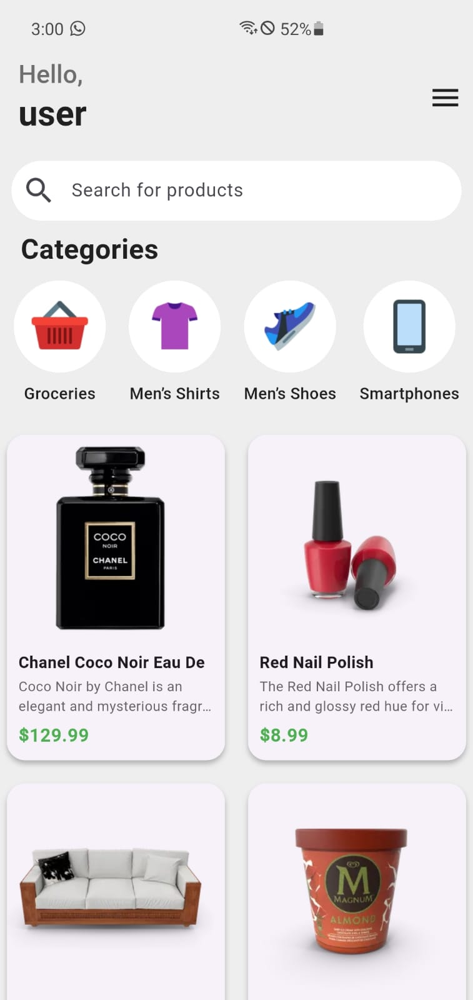
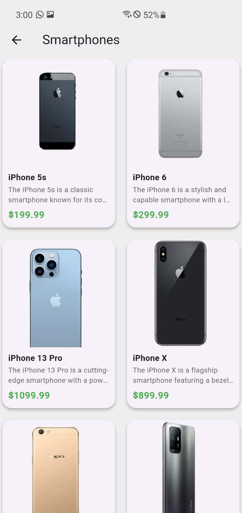
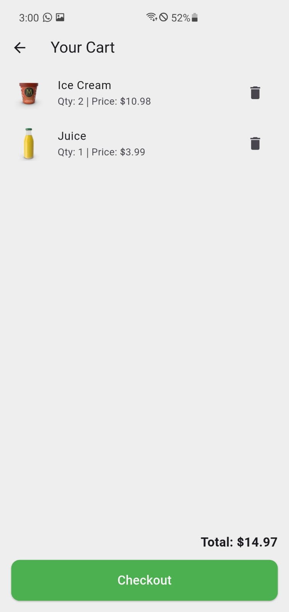

# 🛍️ E-Commerce App (Flutter)


A simple yet modern **e-commerce app** built with **Flutter**.  
It lets users browse a wide range of products from the **DummyJSON API**, view details, add items to their cart, and shop smoothly.  
The app also includes **Firebase authentication** for secure login and signup, providing a seamless shopping experience on both Android and iOS devices.

---

## 📸 Screenshots

**Home Screen**  


**Category Screen**  


**Cart Screen**  


---

## 🚀 Features

- Browse a variety of products from the DummyJSON API
- View detailed product information
- Add and manage items in the cart
- Secure login and signup with Firebase
- Clean, responsive, and user-friendly UI
- Works perfectly on both Android and iOS

---

## 🧰 Tech Stack

- **Framework:** Flutter
- **Language:** Dart
- **Backend API:** DummyJSON API
- **Authentication:** Firebase Auth
- **IDE:** Visual Studio Code / Android Studio

---

## ⚙️ Getting Started

**Clone the repository, navigate to the folder, install dependencies, and run the app:**

```bash
git clone https://github.com/Msaqib295/e-commerce_app.git
cd e-commerce_app
flutter pub get
flutter run
```

## 📚 What I Learned

Through this project, I learned how to connect Flutter with REST APIs, manage app state, and design clean, responsive UIs.
I also implemented a complete Firebase login/signup system, which helped me improve my skills in Flutter app development and gain hands-on experience building real-world mobile applications.

## 📄 License

This project is open-source and available under the MIT License.
I also implemented a complete Firebase login/signup system, which helped me improve my skills in Flutter app development and gain hands-on experience building real-world mobile applications.
